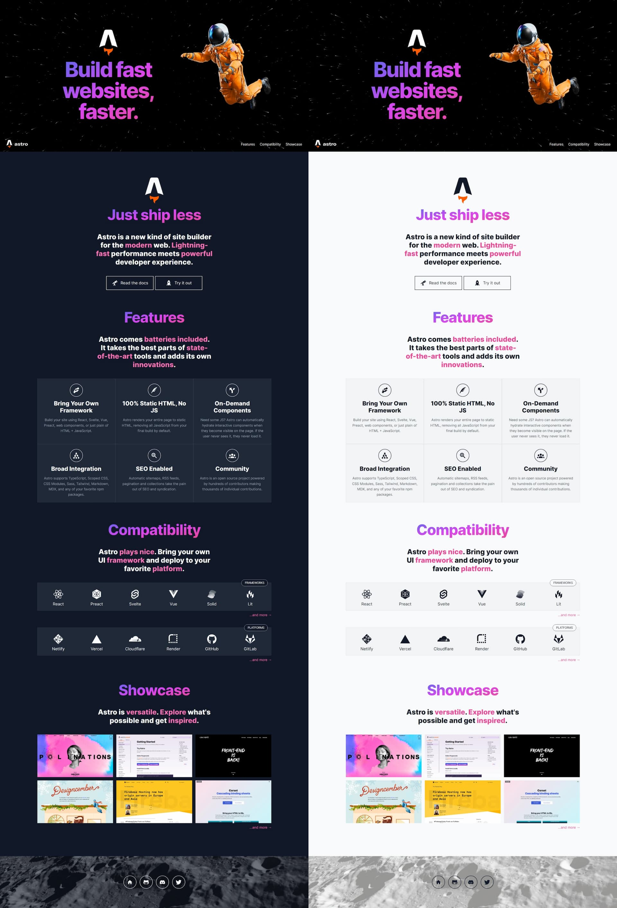

# Astro Landing Page x Nimvio

[](https://astro.build)

> An Astro + Tailwind CSS + Nimvio for landing pages website.



## Features

- 💨 Tailwind CSS for styling
- 🎨 Themeable
  - CSS variables are defined in `src/styles/theme.css` and mapped to Tailwind classes (`tailwind.config.cjs`)
- 🌙 Dark mode
- 📱 Responsive (layout, images, typography)
- ♿ Accessible (as measured by https://web.dev/measure/)
- 🔎 SEO-enabled (as measured by https://web.dev/measure/)
- 🔗 Open Graph tags for social media sharing
- 💅 [Prettier](https://prettier.io/) setup for both [Astro](https://github.com/withastro/prettier-plugin-astro) and [Tailwind](https://github.com/tailwindlabs/prettier-plugin-tailwindcss)

## Nimvio Headless CMS
Astro Landing Page is available on Nimvio as one of the many available built-in themes. Starting a new project in Nimvio is as easy as choosing the theme you like, then start editing your content with Nimvio live preview editor. Start your project now in [Nimvio App](https://app.nimvio.com).

If you want to start Nimvio project from scratch, to make this repository work with Nimvio, the contents you created must follow the following pre-defined content template and content structure. 
### Content Template
| Template Name      | Fields |
| :------------------| :------|
| Button             | URL, Icon_Pack, Icon_Name, Text  |
| Grouping           | Name, Description |
| Header             | Title, Logo_Light, Logo_Dark |
| Layout             | Name, Implementation_Path, Page_Title, Favicon, Meta_Description, Meta_OG_Title, Meta_OG_Type, Meta_OG_Description, Meta_OG_Image, Meta_OG_URL, Placeholders |
| List_Item          | Title, Icon, URL, Description, Image |
| Placeholder        | Name, Widgets |
| Section            | Type, Title, Description, Navigation_Title, Navigation (Show_In_Menu), URL, Content_List |
| Splash             | URL, Logo, Text, Image |

### Content Tree Structure
```
.
└── Content Root/
    ├── Layout/
    │   ├── Layouts/
    │   │   └── Default
    │   └── Placeholders/
    │       ├── Header
    │       ├── Footer
    │       └── Main
    └── Contents/
        ├── Home
        ├── Common
        ├── Introduction
        ├── Features
        ├── Compatibility
        └── Showcase
```        

```
.
└── Contents/
    ├── Home
    ├── Common/
    │   ├── Header/
    │   │   └── Header
    │   ├── Footer/
    │   │   ├── Home
    │   │   └── Github
    │   └── Splash/
    │       └── Splash
    ├── Introduction/
    │   ├── Doc_Button
    │   └── Try_Button
    ├── Features/
    │   ├── BYOF
    │   └── Pure HTML
    ├── Compatibility/
    │   ├── Frameworks/
    │   │   ├── React
    │   │   └── Preact
    │   └── Platforms/
    │       ├── Netlify
    │       └── Vercel
    └── Showcase/
        ├── Astro Docs
        ├── RIOTS
        └── Designcember
```


## Environment Variables

```
#.env.example
PUBLIC_APICD_URL="https://api.nimvio.com/cda/graphql/v1"
PUBLIC_PROJECT_ID="Project_73132f0a-by5b-7344-91db-46831dbefc5c"
PUBLIC_PAGE_CONTENT_ID="Content_3661a98cd-red6-4a89-b315-e32bdef9d58f"
```

## Commands

| Command                | Action                                            |
| :--------------------- | :------------------------------------------------ |
| `npm install`          | Install dependencies                              |
| `npm run dev`          | Start local dev server at `localhost:3000`        |
| `npm run build`        | Build your production site to `./dist/`           |
| `npm run preview`      | Preview your build locally, before deploying      |
| `npm run astro ...`    | Run CLI commands like `astro add`, `astro check`  |
| `npm run astro --help` | Get help using the Astro CLI                      |
| `npm run format`       | Format code with [Prettier](https://prettier.io/) |
| `npm run clean`        | Remove `node_modules` and build output            |

## Credits

- astronaut image
  - source: https://github.com/withastro/astro-og-image; note: this repo is not available anymore
- moon image
  - source: https://unsplash.com/@nasa
- other than that, a lot of material (showcase data, copy) was taken from official Astro sources, in particular https://astro.build/blog/introducing-astro/ and https://github.com/withastro/astro.build
